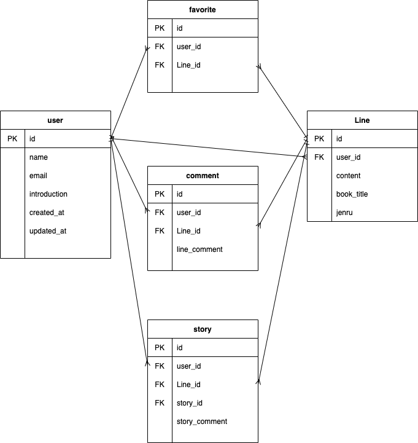
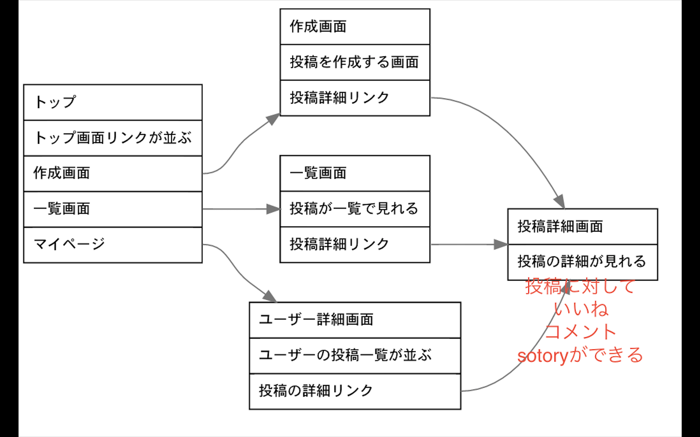

# README

簡易的なリレー小説サイトです。
プログラミングスクールの卒業制作として制作しました。

○完成URL
以下のURLがherokuからデプロイしたものです。ぜひお試しください！
https://relay-novel.herokuapp.com

○制作軌間
2021年5月12日〜5月30日の約1ヶ月です。初めてのアプリ制作だったので時間がかかりました。

○工夫した点
ツリー構造にすることで、だれでもがどの投稿にも話をつなげる様にしたところです。１つの書き出しから無限に話が生まれるところが特徴です。

ER図

UI図

